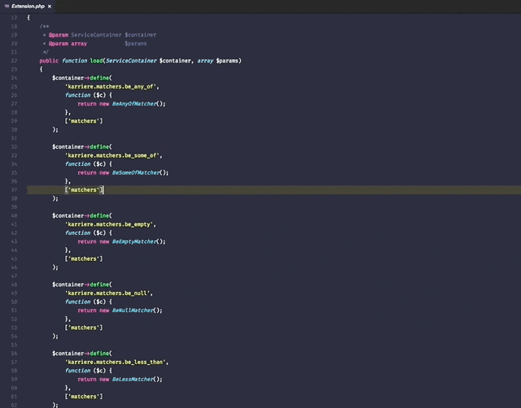
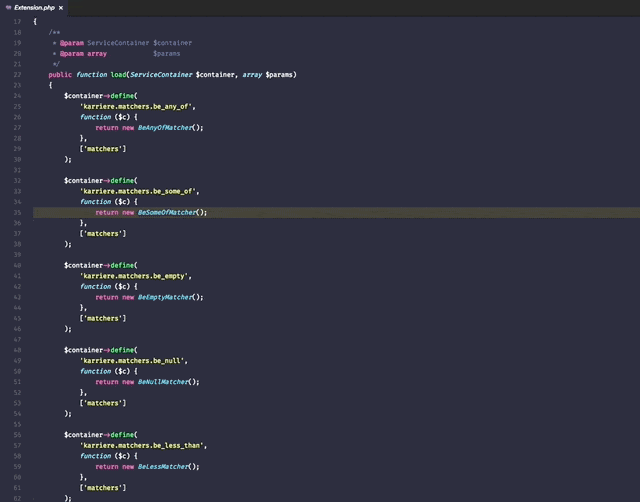

# phpspec Runner

phpspec Runner is a small extension for speeding up phpspec test execution in Visual Studio Code.

## Installation
Press `ctrl+p` and type `ext install phpspec-runner`.

## Commands
To execute the phpspec-runner commands open the command palette and type the following titles:

```json
[
    {
        "command": "phpspec.runAllTests",
        "title": "Run all phpspec tests"
    },
    {
        "command": "phpspec.runClassTests",
        "title": "Run phpspec tests for class"
    }
]
```

## Demo

**Run all phpspec tests:**


**Run phpspec tests for class:**


## Configuration
```json
// path to phpspec executable
"phpspec.binaryPath": "vendor/bin/phpspec",

// phpspec cli arguments
"phpspec.cliArguments": [
"--format=dot",
"--no-interaction"
],
```

## Keybindings

* Run all phpspec tests - `ctrl+shift+t`
* Run phpspec tests for class - `ctrl+shift+c`

This keybindings can be overridden in your `keybindings.json` file.

## License

The MIT License (MIT). Please see the [License File](LICENSE) for more information.